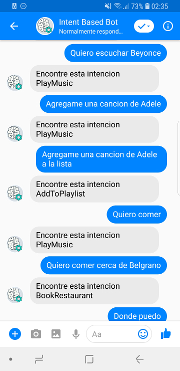
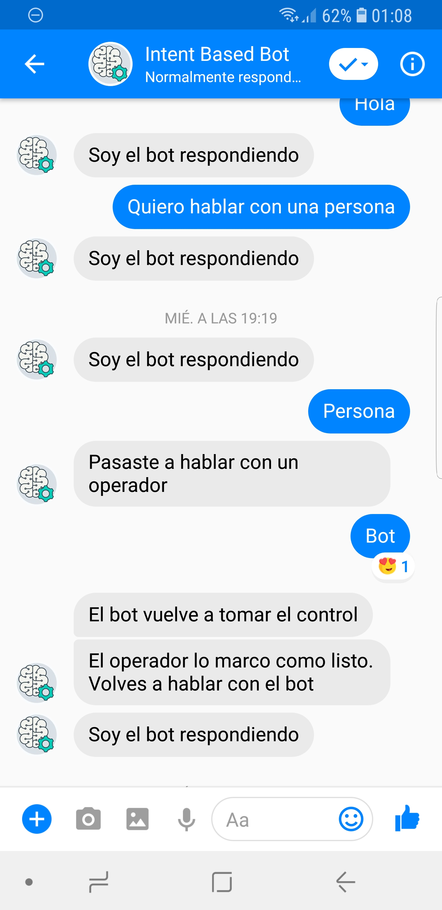

# Intent Based Bot

Conversational engine for ChatBot fully based on intents using deep learning models and external NLP APIs. Supports primary and secondary modes of Facebook Handover Protocol.  
Some Jupyter Notebooks are provided for testing the application.  
You must provide a `config.py` file with your keys and configuration in `intentbasedbot` package and a model trained on `instance/model`
You could download one trained on [SNIPS Dataset](https://github.com/snipsco/nlu-benchmark/tree/master/2017-06-custom-intent-engines) [here](https://s3-us-west-2.amazonaws.com/intent-based-bot/models/model.zip) in english and spanish.

## Screenshots



## Libraries used
`flask`, `requests`, `ansicolors`, `rfc3339`, `pymessenger`, `pandas`,`numpy`, `keras`, `scikit-learn`, `tensorflow`


## Deploy with Docker
```bash
# Zip all files
zip -r intent-based-bot.zip Dockerfile requirements.txt setup.py intentbasedbot

# Upload the zip file.
scp intent-based-bot.zip $DNS_INSTANCE_NAME:/home/ubuntu/

# Linking local 5001 port with 5000 in AWS.
ssh -L 5001:127.0.0.1:5000 $DNS_INSTANCE_NAME

# In AWS
docker build -t intent-based-bot . 
docker run --rm -p 5000:5000 --name intent-based-bot intent-based-bot
```
## Deploy with with Virtual Environment
```bash
# Ubuntu 16.04 comes with Python 2.7
# Install Python 3.6
sudo add-apt-repository ppa:deadsnakes/ppa
sudo apt-get update
sudo apt-get install python3.6

# Install virtual environments
pip3 install virtualenv

# Create virtual environment with new python executable in ~/intent-based-bot
virtualenv env --python=python3.6

# Activate it
source env/bin/activate

# Install all dependencies
pip3 install -r requirements.txt

pip3 install -e .

# Set Flask variables
export FLASK_APP=intentbasedbot && export FLASK_DEBUG=true

# And run
flask run --host=0.0.0.0
```
